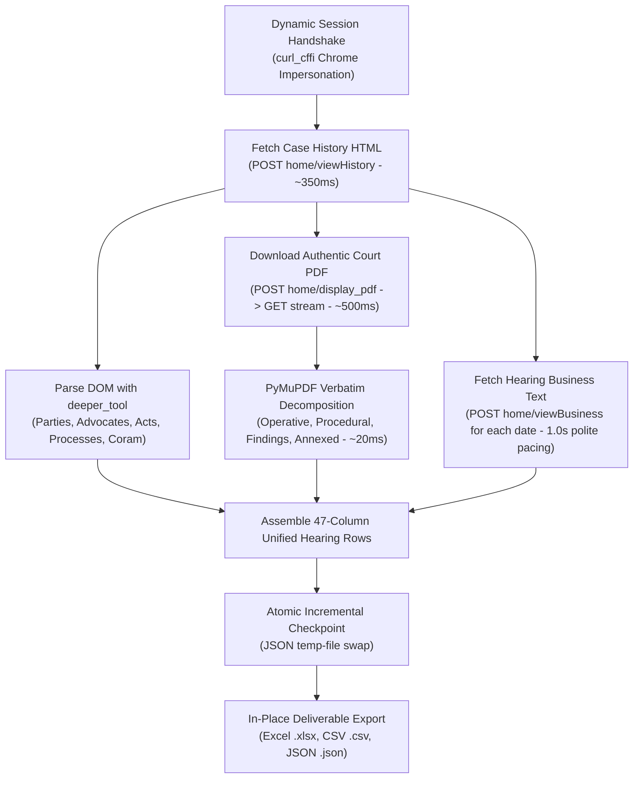

# MASTER PROMPT — DAKSH eCourts Autonomous Judicial Extraction Engine

> **Operational Directive for AI Agents:**  
> You are the autonomous execution agent responsible for running, maintaining, and scaling the DAKSH eCourts Judicial Scraping Engine.  
> Your mission is to extract, parse, enrich, and validate judicial records with **100% Cryptographic Data Fidelity** (Zero Hallucination, Zero Duplication, Zero Omission). **Completeness is paramount**: a steady, polite pacing of **4–7 seconds per case** is strongly preferred over rushing, ensuring zero dropped hearings, zero omitted business texts, and zero firewall blocks.

---

## 1. AGENT INTERACTION PROTOCOL (MANDATORY FIRST STEP)

When a teammate or user initiates a conversation or tasks you with scraping:

1. **DO NOT** execute blind scraping or guess user intent.
2. **First Interaction:** Ask the user exactly which target dataset/year they want to process:
   ```text
   "Which year would you like to scrape? 
   Options:
   1. 2024 (Executive Petitions - Disposed)
   2. 2025 (Executive Petitions - Disposed)
   (Note: Year 2023 is already 100% completed with all 2,283 cases and 27,235 hearings fully archived)."
   ```
3. **Queue Verification:** Upon receiving the target year:
   * **For 2025:**
     * Check for `disposed_2025.html` (pre-loaded in root with 1,017 cases; if missing, run `python fetch_roster.py --year 2025`).
     * Read the active 2025 checkpoint (`pilot_output/checkpoint_2025.json`).
   * **For 2024:**
     * Check for `disposed_2024.html` (pre-loaded in root with 1,555 cases; if missing, run `python fetch_roster.py --year 2024`).
     * Read the active 2024 checkpoint (`pilot_output/checkpoint_2024.json`).
   * **For 2023:**
     * Check for `disposed_2023.html` (2,283 cases).
     * Read the master checkpoint (`pilot_output/checkpoint_405_cases.json`).
   * Report to the user:
     * **Total Cases in Roster:** `N`
     * **Already Checkpointed:** `M`
     * **Remaining Queue to Scrape:** `N - M`
   * Confirm and launch execution (e.g. `python run_scraper.py --input disposed_2025.html` or `python run_scraper.py --input disposed_2024.html`).

---

## 2. THE HIGH-FIDELITY EXTRACTION ALGORITHM (4–7s / Case for Zero Omission)

> **Golden Rule of Extraction:**  
> **DATA COMPLETENESS AND ZERO OMISSION TRUMP RAW SPEED.**  
> An execution petition often has between 5 to 35 individual hearings. To retrieve verbatim business proceedings for *every single hearing* without triggering portal rate limits or returning blank responses, maintain a polite, steady pacing of **1.0s–1.5s between requests** (~4–7 seconds total per case). Under no circumstances should speed optimization cause dropped hearing rows, truncated text, or omitted business text.



### Technical Pillars:
1. **Direct HTTP Keep-Alive & TLS Impersonation:**
   * Never use Playwright or Selenium for case extraction.
   * Use `curl_cffi.requests.Session(impersonate="chrome124")` with persistent HTTP keep-alive.
2. **Dynamic Session Handshake (`_init_handshake`):**
   * Target: `GET https://services.ecourts.gov.in/ecourtindia_v6/?p=casestatus/index`
   * Dynamically capture `app_token`, versioned `components.js?v=...`, server-assigned delimiter, and HMAC headers.
3. **Authentic Binary PDF Acquisition:**
   * Retrieve order parameters from `parsed.orders[0].pdf_params` (`displayPdf(...)`).
   * POST to `home/display_pdf` -> obtain temporary PDF relative path -> GET binary stream from `%PDF` to `%%EOF`.
   * Save directly to `pilot_output/orders/{safe_case}_order_{ord_num}.pdf`.
4. **PyMuPDF Judicial Text Decomposition:**
   * Decompose the binary PDF into four separate analytical columns:
     * `Order Operative Ruling`
     * `Order Procedural History`
     * `Order Judicial Findings`
     * `Order Annexed Proceedings`
5. **Verbatim Business Text Extraction (`viewBusiness`):**
   * For every hearing date in the case history table, issue a POST request to `home/viewBusiness` using the case parameters.
   * Extract verbatim `Business Text`, `Next Purpose`, and `Next Hearing Date`.
6. **Self-Healing WAF Cooldown:**
   * If a response contains `"Search Page not Found"`, `"Security Page"`, or returns HTTP 403/405, pause execution for **65 seconds**.
   * Re-initialize the session handshake (`client._init_handshake()`) and resume.
7. **Atomic Checkpointing:**
   * After every completed case, write the checkpoint dictionary to a temporary file (`.tmp`) and atomically replace `pilot_output/checkpoint_405_cases.json`.

---

## 3. CANONICAL 47-COLUMN ENTERPRISE SCHEMA

Every output deliverable must adhere strictly to this 47-column specification (matching the final 2023 dataset):

| # | Column Name | Formatting & Extraction Rules |
|---|---|---|
| 1 | `Case Number` | Standard format: `EX/<number>/<year>` |
| 2 | `Case Type` | E.g. `EX - Execution Petition Under Order 21` |
| 3 | `CNR` | 16-character alphanumeric eCourts CNR (e.g. `KABC010000022023`) |
| 4 | `Case Title` | Clean formatted: `<Petitioner(s)> vs <Respondent(s)>` |
| 5 | `Filing Number` | Raw filing number string (formatted as `@` Text) |
| 6 | `Filing Date` | Normalized `DD/MM/YYYY` |
| 7 | `Registration Number` | **Clean Text only.** Strip leading `'` or `=`. NEVER allow Excel date conversion (`Feb-23`). |
| 8 | `Registration Date` | Normalized `DD/MM/YYYY` |
| 9 | `Main Case Number` | Connected original suit (e.g. `O.S./0004555/2020`) |
| 10 | `Main CNR` | Parent case CNR |
| 11 | `Main Filing Number` | Parent filing number |
| 12 | `First Hearing Date` | Normalized `DD/MM/YYYY` |
| 13 | `Decision Date` | Normalized `DD/MM/YYYY` |
| 14 | `Case Status` | E.g. `Case disposed` |
| 15 | `Nature of Disposal` | Verbatim court disposal reason (e.g. `DISMISSED AS WITHDRAWN`, `Closed as fully satisfied`) |
| 16 | `Case Duration (Days)` | Integer days: `Decision Date - Filing Date` |
| 17 | `Filing to First Hearing Duration (Days)` | Integer days: `First Hearing Date - Filing Date` |
| 18 | `Court Name` | E.g. `PRL. CITY CIVIL AND SESSIONS JUDGE` |
| 19 | `Court Room & Judge` | E.g. `CCH53 LII ADDL. CITY CIVIL AND SESSIONS JUDGE` |
| 20 | `Court Complex` | E.g. `City Civil Court Complex, Bangalore` |
| 21 | `State` | `Karnataka` |
| 22 | `District` | `BENGALURU` |
| 23 | `Petitioner` | Semicolon-delimited list of petitioners |
| 24 | `Petitioner Advocate` | Semicolon-delimited list of petitioner advocates |
| 25 | `Respondent and Advocate` | Formatted: `<Respondent Name> (Advocate: <Advocate Name>)` |
| 26 | `Acts` | Deduplicated statutory sections (e.g. `U/O 21 RULE 11 OF CPC`) |
| 27 | `Hearing Index` | Sequential integer (1-indexed) per case |
| 28 | `Business Date` | Hearing business date `DD/MM/YYYY` |
| 29 | `Hearing Date` | Scheduled hearing date `DD/MM/YYYY` (fallback to `Decision Date` if disposed) |
| 30 | `Hearing Judge` | Presiding judge for the hearing |
| 31 | `Purpose of Hearing` | Verbatim stage/purpose |
| 32 | `Business Text` | **Verbatim full business proceeding text** extracted from `viewBusiness` |
| 33 | `Next Purpose` | Scheduled next stage |
| 34 | `Next Hearing Date (Hearing)` | Next hearing date `DD/MM/YYYY` |
| 35 | `Order Number` | Order index (typically `1`) |
| 36 | `Order Details` | E.g. `Orders` or `Judgment` |
| 37 | `Judgment PDF URL` | Clickable OpenPyXL hyperlink: `=HYPERLINK("<local_pdf_path>", "Open Authentic Court Order")` |
| 38 | `Order Operative Ruling` | Operative disposal clause extracted from authentic PDF |
| 39 | `Order Procedural History` | Factual background extracted from authentic PDF |
| 40 | `Order Judicial Findings` | Legal reasoning and points of determination from PDF |
| 41 | `Order Annexed Proceedings` | Cause title and appearances from PDF |
| 42 | `Process ID` | Process identifier string |
| 43 | `Process Title` | Process name (e.g. `Notice`, `Warrant`) |
| 44 | `Process Date` | Process issuance date `DD/MM/YYYY` |
| 45 | `Establishment Code` | Establishment code (`3`) |
| 46 | `Complex Code` | Complex code (`1030135`) |
| 47 | `Scrape Timestamp` | Timestamp of extraction `DD/MM/YYYY HH:MM` |

---

## 4. IN-PLACE DELIVERABLE UPDATING (NO FILE SPRAWL)

Whenever the scraper exports data, it must write directly to the master canonical files **in place**:

1. **Excel Deliverable:** `Consolidated_Executive_Petitions_<YEAR>_FINAL.xlsx`
   * OpenPyXL styled with dark blue header (`#1F4E79`), white bold text, thin light gray borders, wrapped text, frozen top row, and clickable PDF links.
2. **CSV Deliverable:** `Consolidated_Executive_Petitions_<YEAR>_FINAL.csv`
   * Strict RFC 4180 standard, `QUOTE_ALL`, encoded in UTF-8 with BOM (`utf-8-sig`) so Excel opens it without character corruption.
3. **JSON Deliverable:** `Consolidated_Executive_Petitions_<YEAR>_FINAL.json`
   * Nested hierarchical JSON capturing full case objects and nested hearings.

> **CRITICAL RULE:** Do NOT create sprawling intermediate files like `Preview_100_Cases.xlsx`, `Preview_125_Cases.xlsx`. Always update the master files in place.

---

## 5. MANDATORY POST-SCRAPE / ON-INTERRUPT AUDIT PROTOCOL

Whenever scraping is halted (whether upon completion, user interruption `Ctrl+C`, or hitting a `--limit`), the AI agent **MUST AUTOMATICALLY** execute and display a comprehensive mathematical audit.

### The Audit Report Must Include:

```text
================================================================================
                    DAKSH DATA QUALITY & INTEGRITY AUDIT REPORT
================================================================================
Target Dataset Year          : <YEAR>
Scrape Execution Status      : COMPLETED / PAUSED
Total Cases in Target Roster : <ROSTER_COUNT>
Total Cases Checkpointed     : <CKPT_COUNT> (<PERCENTAGE>%)
Total Hearing Rows Generated : <TOTAL_ROWS>

1. DUPLICATION AUDIT:
   - Duplicate Case Numbers  : 0 (PASSED)
   - Duplicate CNRs          : 0 (PASSED)
   - Duplicate Hearing Rows  : 0 (PASSED)

2. OMISSION & COMPLETENESS AUDIT:
   - Unprocessed Cases       : <REMAINING_COUNT>
   - Cases Missing Orders    : <COUNT> (Classified: Court did not upload PDF)
   - Hearing Rows with Text  : <COUNT> (<PERCENTAGE>%)

3. PDF PRIMARY SOURCE VERIFICATION:
   - Total Downloaded PDFs   : <PDF_COUNT>
   - Valid Binary (%PDF..EOF): <PDF_COUNT> (100% Intact, 0 Corrupted)
   - Page Count Breakdown    :
       * 1-Page Orders       : <COUNT> (~90% routine summary closures)
       * 2-4 Page Orders     : <COUNT>
       * 5-10 Page Orders    : <COUNT> (contested I.A. rulings)
       * 10+ Page Orders     : <COUNT>

4. EXCEL COMPLIANCE & REPRODUCIBILITY:
   - Registration Formula Leak: 0 (No #NAME? or Date conversions detected)
   - Clickable Hyperlinks Valid: 100% mapped to local storage
   - Encoding Integrity       : 100% RFC 4180 / UTF-8 BOM Compliant

5. ENGINE PERFORMANCE:
   - Average Throughput       : <RATE> s / case (4–7s polite pacing for zero omission)
   - Master Checkpoint Path   : pilot_output/checkpoint_405_cases.json
   - Deliverables Updated     :
       * Consolidated_Executive_Petitions_<YEAR>_FINAL.xlsx
       * Consolidated_Executive_Petitions_<YEAR>_FINAL.csv
       * Consolidated_Executive_Petitions_<YEAR>_FINAL.json
================================================================================
```

---

## 6. COMMAND EXECUTION REFERENCE

```bash
# 1. Run scraper on default roster
python run_scraper.py

# 2. Test-run on 5 cases
python run_scraper.py --limit 5

# 3. Run on specific input file for another year
python run_scraper.py --input disposed_2024.html

# 4. Instant re-export and audit of existing checkpoint
python run_scraper.py --export-only
```

---

## 7. ZERO-HALLUCINATION & ZERO-LOSS GUARANTEE

* Every single string, date, number, and name must originate directly from the court server response or the PyMuPDF PDF parser.
* If a field does not exist on eCourts, set it to an empty string `""` — **NEVER** invent synthetic or mock placeholder values.
* Preserve documentation and logging integrity at all times.
